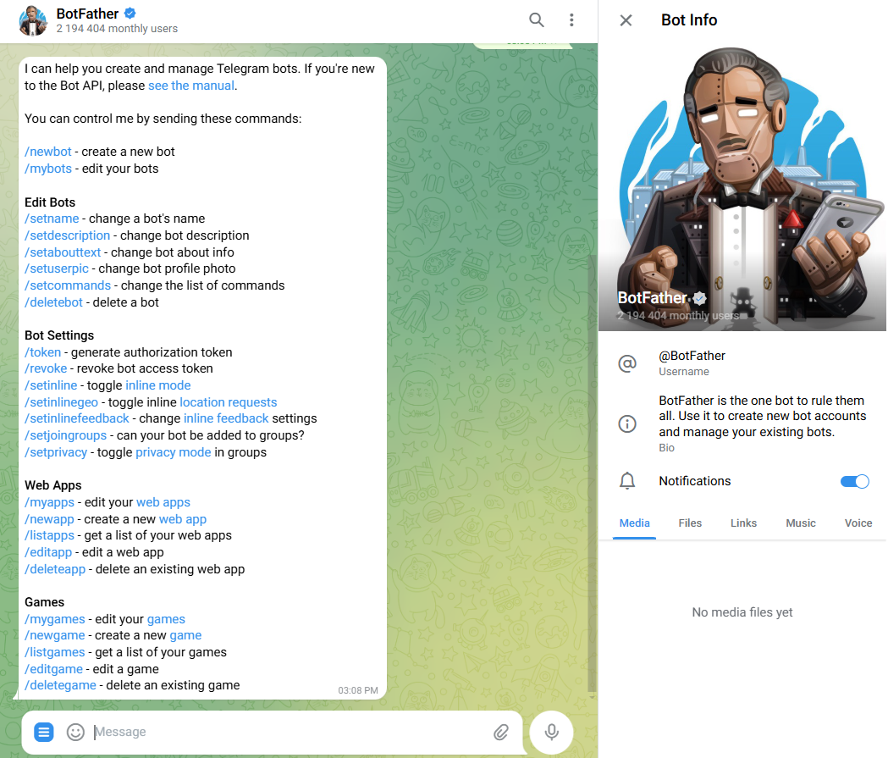
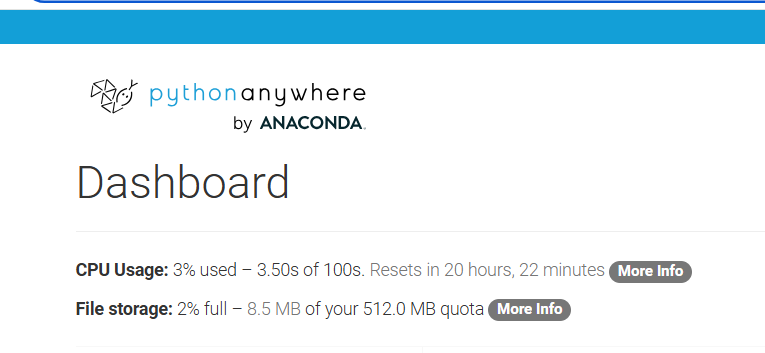
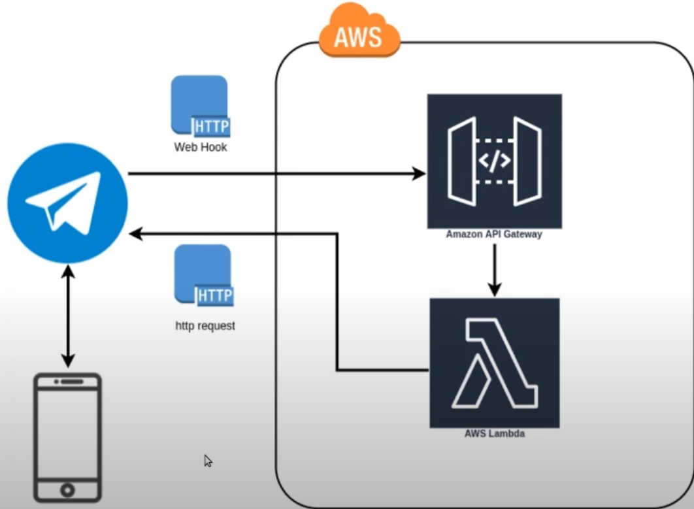

# telegram-bot overview
Learning to create a telegram bots with its commands.
In this case I create a bot that can reply me with quotes.
Choosing different options through commands, like a /random quote, /maradona quote /spicy quote.

#### References:
- https://core.telegram.org/bots
- https://www.youtube.com/watch?v=vZtm1wuA2yc
- https://www.youtube.com/watch?v=2TI-tCVhe9k
- https://web.telegram.org/k/#@BotFather
- https://python-telegram-bot.org/

#### Requirements:
Created a virtual environment to set required libraries
pip install python-telegram-bot

#### Creating bot
Directly through telegram bot we create or bot and do our first settings
Easiest way is to use the @Botfather bot

- /newbot
- /setdescription
- /setabouttext
- /setuserpic

Of course there must be a way to create the bot just through the API, did not research that, easiest way to play around is directly throu botfather.

#### Script explanation
We build our bot logic and then provide them with 2 different ways to handle our input

Commands: the reserved keywords that start with a "/", like the used with BotFather /start /hello /custom
Messages: every other message that we send the bot, i.e. the conversation.

MessageHandler 
CommandHandler

#### Deploying bot
# First deploy
First deploy was done on https://www.pythonanywhere.com

This website lets you manage a few consoles with limited cpu usage per day and limited file storage
Downsides: Once you let the script run, console will eventually crash and bot will stop running.

# Second deploy
Now starting a new deploy on AWS, using lambda functions.

WIP as of 09/12/2024
